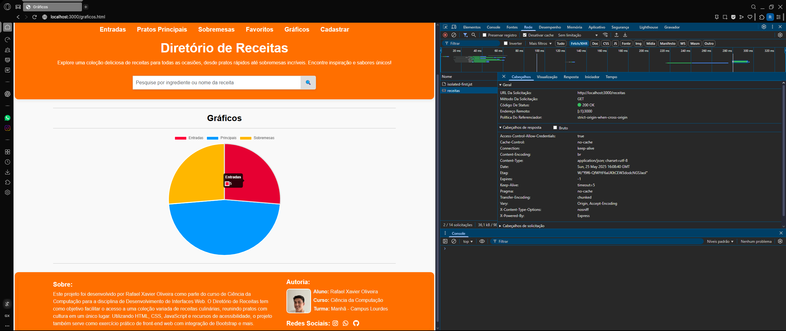

# Trabalho Prático - Semana 14

A partir dos dados cadastrados na etapa anterior, vamos trabalhar formas de apresentação que representem de forma clara e interativa as informações do seu projeto. Você poderá usar gráficos (barra, linha, pizza), mapas, calendários ou outras formas de visualização. Seu desafio é entregar uma página Web que organize, processe e exiba os dados de forma compreensível e esteticamente agradável.

Com base nos tipos de projetos escohidos, você deve propor **visualizações que estimulem a interpretação, agrupamento e exibição criativa dos dados**, trabalhando tanto a lógica quanto o design da aplicação.

Sugerimos o uso das seguintes ferramentas acessíveis: [FullCalendar](https://fullcalendar.io/), [Chart.js](https://www.chartjs.org/), [Mapbox](https://docs.mapbox.com/api/), para citar algumas.

## Informações do trabalho

- Nome: Rafael Xavier Oliveira
- Matricula: 893046
- Proposta de projeto escolhida: Diretório de Receitas
- Breve descrição sobre seu projeto: Foi escolhido o projeto diretório de receitas com uma página web bem estruturada, feito com um layout em HTML usando Bootstrap, com uma aparência limpa e responsiva, além de um conjunto de seletores CSS personalizados para uma melhor formatação, e uma codificação em JavaScript para dinamização da página. Posteriormente, foi simulado um back-end utilizando um arquivo JSON com dados montados e, com uma nova implementação da dinâmica CRUD, permitindo a leitura, criação, atualização e exclusão de receitas, tornando, assim, um projeto mais funcional, prático e usual, permitindo uma melhor espansão e controle dos dados e até mesmo do projeto. Na etapa conseguinte, foi implementada uma funcionalidade com o objetivo de mostrar um gráfico de pizza com a porcentagem/quantidade de receitas para cada categoria disponível na estrutura de dados (entradas, principais ou sobremesas), por meio do Chart.js, permitindo uma visualização simplória e intuitiva ao usuário.

**Print da tela com a implementação**

Na etapa atual, foi implementada uma funcionalidade com o objetivo de mostrar um gráfico de pizza com a porcentagem/quantidade de receitas para cada categoria disponível na estrutura de dados (entradas, principais ou sobremesas), por meio Chart.js, permitindo uma visualização simplória e intuitiva ao usuário.

