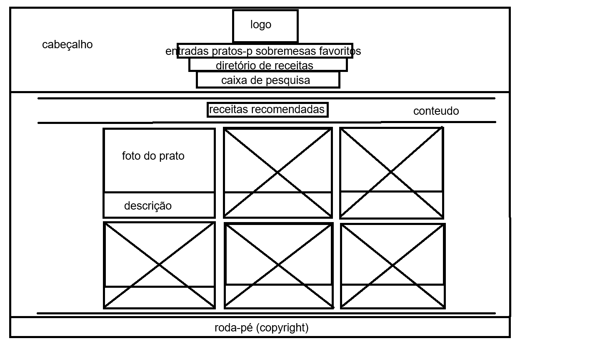
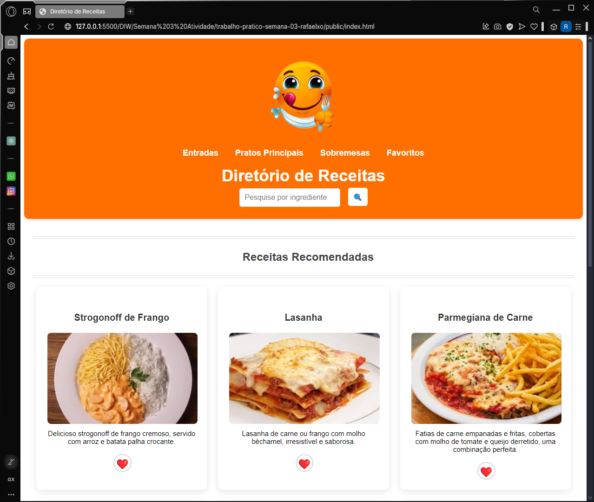

# Trabalho Prático - Semana 03

Dessa vez, vamos escolher uma proposta de projeto para trabalhar. Na [lista de propostas de projetos](propostas-projetos.md), escolha um dentre as alternativas.

Nessa atividade, você deverá montar a página inicial do projeto escolhido, a organização do HTML aplicando semântica correta e uso aprimorado do CSS. Leia o enunciado completo no Canvas para mais detalhes.

**IMPORTANTE:** Você deve trabalhar e alterar apenas arquivos dentro da pasta **`public`**. Deixe todos os demais arquivos e pastas desse repositório inalterados. **PRESTE MUITA ATENÇÃO NISSO.**

## Informações Gerais

- Nome: Rafael Xavier Oliveira
- Matricula: 893046
- Proposta de projeto escolhida: Diretório de Receitas
- Breve descrição sobre seu projeto: Foi escolhido e criado um projeto básico de um diretório de receitas, incluindo um layout de uma página web, acompanhado de um projeto estrutural em HTML com emprego de tags semânticas e conceito de componentes (header, footer, main, nav, section, article, etc.), além de uma combinação de seletores CSS para a formatação estruturada dessa página HTML (box-model: margin e padding, display, position, etc.).

## Print do esboço criada

## Print da home-page criada

