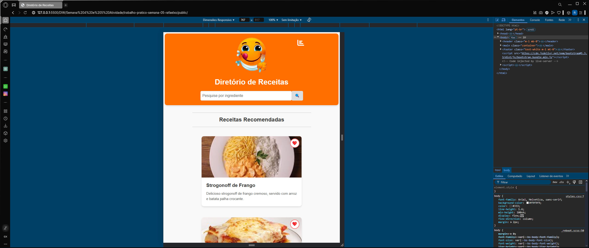

# Trabalho Prático - Semana 04 e 05

Dessa vez, vamos dar sequência ao projeto iniciado na semana passada. Se você ainda não fez o projeto da semana anterior, fique atento, se programe e procure colocar as atividades em dia. Volte lá, leia tudo e faça sua parte pois essa atividade depende da atividade anterior..

Nessa atividade,vamos evoluir o projeto para que a home-page funcione bem tanto no celular quanto no desktop, entendendo também como é o processo gradativo e colaborativo de desenvolvimento de um software, registrando cada etapa no histórico de commits do repositório do git/GitHub.

**IMPORTANTE:** Você deve trabalhar e alterar apenas arquivos dentro da pasta **`public`,** mantendo os arquivos **`index.html`** e **`styles.css`** com estes nomes. Deixe todos os demais arquivos e pastas desse repositório inalterados. **PRESTE MUITA ATENÇÃO NISSO.**

## Informações Gerais

- Nome: Rafael Xavier Oliveira
- Matricula: 893046
- Proposta de projeto escolhida: Diretório de Receitas
- Breve descrição sobre seu projeto: Foi escolhido e criado um projeto de um diretório de receitas, incluindo um layout de uma página web, contendo uma estrutura em HTML acompanhado de uma combinação de seletores CSS para a formatação estruturada dessa página HTML. Após isso, foram implementadas media queries para uma melhor responsividade em dispositivos de menores resoluções (430px - 767px) e, posteriormente, uma re-formatação desse projeto com o uso do bootstrap, deixando um arquivo mais limpo e uma melhor empregabilidade dos itens para um melhor aproveitamento do material pelo usuário.

## Print da versão responsiva com CSS puro

## Print da versão responsiva com Bootstrap

