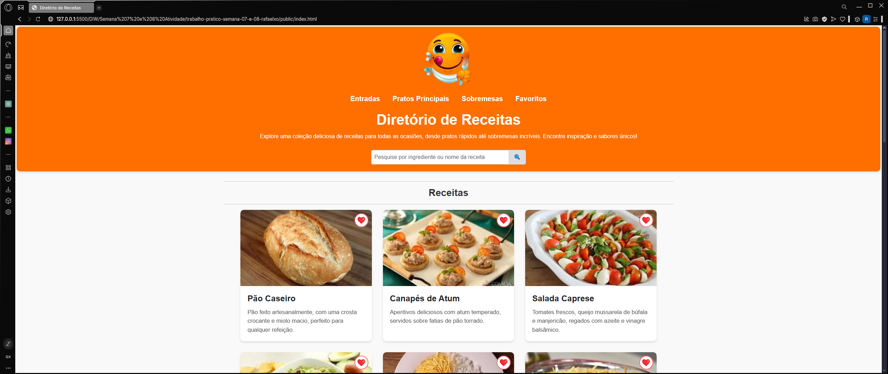
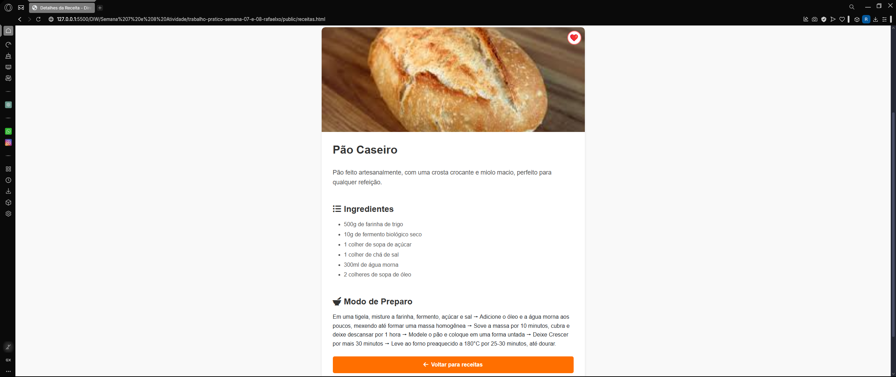

# Trabalho Prático - Semana 07

**Páginas de detalhes dinâmicas**

Nessa etapa, vamos evoluir o trabalho anterior, acrescentando a página de detalhes, conforme o  projeto escolhido. Imagine que a página principal (home-page) mostre um visão dos vários itens que existem no seu site. Ao clicar em um item, você é direcionado pra a página de detalhes. A página de detalhe vai mostrar todas as informações sobre o item do seu projeto. seja esse item uma notícia, filme, receita, lugar turístico ou evento.

Leia o enunciado completo no Canvas. 

**IMPORTANTE:** Assim como informado anteriormente, capriche na etapa pois você vai precisar dessa parte para as próximas semanas. 

**IMPORTANTE:** Você deve trabalhar e alterar apenas arquivos dentro da pasta **`public`,** mantendo os arquivos **`index.html`**, **`styles.css`** e **`app.js`** com estes nomes, conforme enunciado. Deixe todos os demais arquivos e pastas desse repositório inalterados. **PRESTE MUITA ATENÇÃO NISSO.**

## Informações Gerais

- Nome: Rafael Xavier Oliveira
- Matricula: 893046
- Proposta de projeto escolhida: Diretório de Receitas
- Breve descrição sobre seu projeto: Foi escolhido o projeto diretório de receitas com uma página web bem estruturada, feito com um layout em HTML usando Bootstrap, com uma aparência limpa e responsiva, além de um conjunto de seletores CSS ersonalizados para uma melhor formatação. Após isso, foi feito um arquivo JavaScript, com uma home-page para carregar as receitas dinamicamente em cards, e cada um redireciona para a página de detalhes ao clicar. O menu de navegação, também criado pelo código, tem links para categorias como entradas, pratos principais, sobremesas e favoritos, filtrando as receitas com base no que está na URL, mostrando só os itens correspondentes. Assim, o projeto se tornou prático e mais organizado.

## Print da versão responsiva com CSS puro

## Print da versão responsiva com Bootstrap

